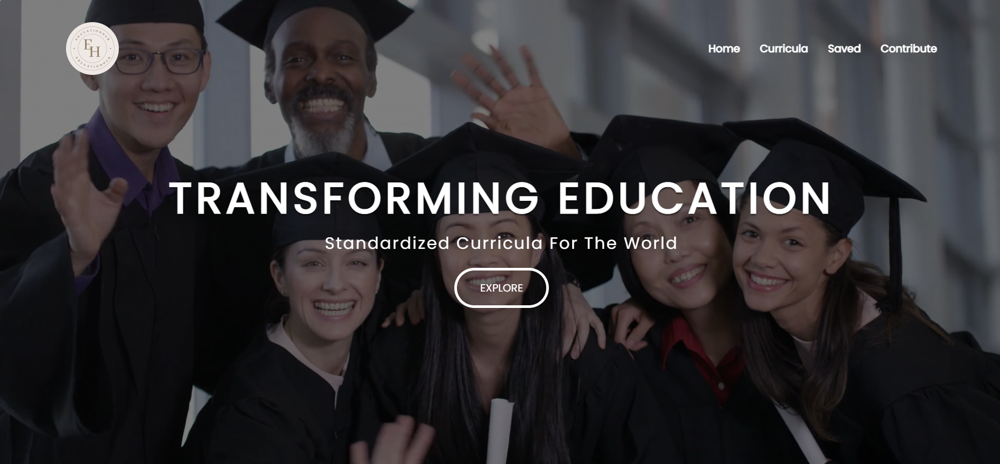
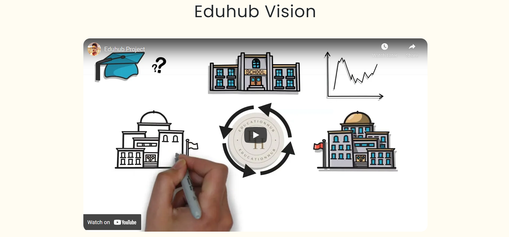
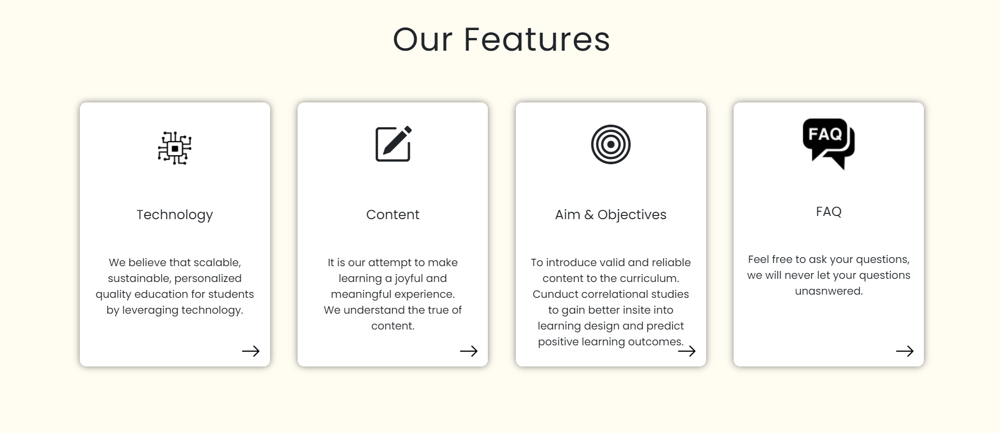

# Open-Curriculum
   & Bootstrap  

<i><b>Project under Smart India Hackathon 2022.</b></i> 

I worked on UI/UX & Frontend.

It is an open-source project that allows anyone to contribute.

It's a website that allows Schools & Universities to have updated curricula.
  

  

 
<h1>Home Page</h1>
 

  

 
<h1>Eduhub Vision</h1>
 

  

 
<h1>Features</h1>
 

  

